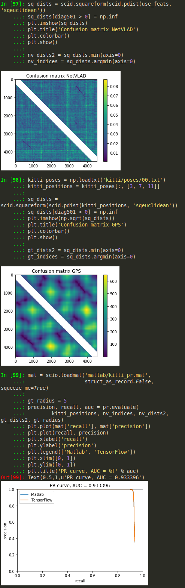

# netvlad_tf

The main intention of this repo is deployment of a full [NetVLAD](https://www.di.ens.fr/willow/research/netvlad/) network, which was [originally implemented in Matlab](https://github.com/Relja/netvlad), in Python. We provide the weights corresponding to the best model as TensorFlow checkpoint. The repository also contains code that can be used to import other models that were trained in Matlab, as well as tests to make sure that Python produces similar results as Matlab.

We might or might not port the training code to Python/TensorFlow in the future. See GitHub issues.

For your convenience, here is the BibTeX of NetVLAD:

```bibtex
@InProceedings{Arandjelovic16,
  author       = "Arandjelovi\'c, R. and Gronat, P. and Torii, A. and Pajdla, T. and Sivic, J.",
  title        = "{NetVLAD}: {CNN} architecture for weakly supervised place recognition",
  booktitle    = "IEEE Conference on Computer Vision and Pattern Recognition",
  year         = "2016",
}
```

This TensorFlow port has been written at [the Robotics and Perception Group](http://rpg.ifi.uzh.ch), University of Zurich and ETH Zurich.

## Citation ##

If you use this code in an academic context, please cite the following [ICRA'18 publication](http://rpg.ifi.uzh.ch/docs/ICRA18_Cieslewski.pdf):

T. Cieslewski, S. Choudhary, D. Scaramuzza:
**Data-Efficient Decentralized Visual SLAM**
IEEE International Conference on Robotics and Automation (ICRA), 2018.

## Deploying the default model

Download the checkpoint [here](http://rpg.ifi.uzh.ch/datasets/netvlad/vd16_pitts30k_conv5_3_vlad_preL2_intra_white.zip)(1.1 GB). Extract the zip and move its contents to the `checkpoints` folder of the repo. 

Add the `python` folder to `$PYTHONPATH`. Alternatively, ROS users can simply clone this repository into the `src` folder of a catkin workspace.

Python dependencies, which can all be downloaded with `pip` are:
```
numpy
tensorflow-gpu

matplotlib (tests only)
opencv-python (tests only)
scipy (model importing only)
```

The default network can now be deployed as follows:
```py
import cv2
import numpy as np
import tensorflow as tf

import netvlad_tf.net_from_mat as nfm
import netvlad_tf.nets as nets

tf.reset_default_graph()

image_batch = tf.placeholder(
        dtype=tf.float32, shape=[None, None, None, 3])

net_out = nets.vgg16NetvladPca(image_batch)
saver = tf.train.Saver()

sess = tf.Session()
saver.restore(sess, nets.defaultCheckpoint())

inim = cv2.imread(nfm.exampleImgPath())
inim = cv2.cvtColor(inim, cv2.COLOR_BGR2RGB)

batch = np.expand_dims(inim, axis=0)
result = sess.run(net_out, feed_dict={image_batch: batch})
```

### A test to make sure that you get the correct output

To verify that you get the correct output, download [this mat](http://rpg.ifi.uzh.ch/datasets/netvlad/example_stats.mat) (83MB) and put it into the `matlab` folder. Then, you can run `tests/test_nets.py`: if it passes, you get the same output as the Matlab implementation for the example image. Note: [An issue](https://github.com/uzh-rpg/netvlad_tf_open/issues/1) has been reported where some versions of Matlab and Python load images differently.

## Importing other models trained [with Matlab](https://github.com/Relja/netvlad)

Assuming you have a `.mat` file with your model:

1. Run it through `matlab/net_class2struct`. This converts all serialized classes to serialized structs and is necessary for Python to be able to read all data fields. Note that Matlab needs access to the corresponding class definitions, so you probably need to have NetVLAD set up in Matlab.
2. Make sure it runs through `net_from_mat.netFromMat()`. You might need to adapt some of the code there if you use a model that differs from the default one. It is helpful to use the [Matlab variable inspector](https://ch.mathworks.com/help/matlab/matlab_env/create-and-edit-variables.html) for debugging here.
3. Adapt and run `tests/test_net_from_mat.py`. This helps you to ensure that all intermediate layers produce reasonably similar results.
4. See `mat_to_checkpoint.py` for how to convert a mat file to a checkpoint. Once you have the checkpoint, you can define the network from scratch (compare to `nets.vgg16NetvladPca()`). Now, if all variables have been named consistently, you have a pure TensorFlow version of your NetVLAD network model. See `tests/test_nets.py` for a test that also verifies this implementation.

### Performance test on KITTI 00

See `matlab/kitti_pr.m` and `tests/test_kitti.py` for further testing which ensures that place recognition performance is consistent between the Matlab and Python implementations. This test requires the [grayscale odometry data of KITTI](http://www.cvlibs.net/datasets/kitti/eval_odometry.php) to be linked in the main folder of the repo.


